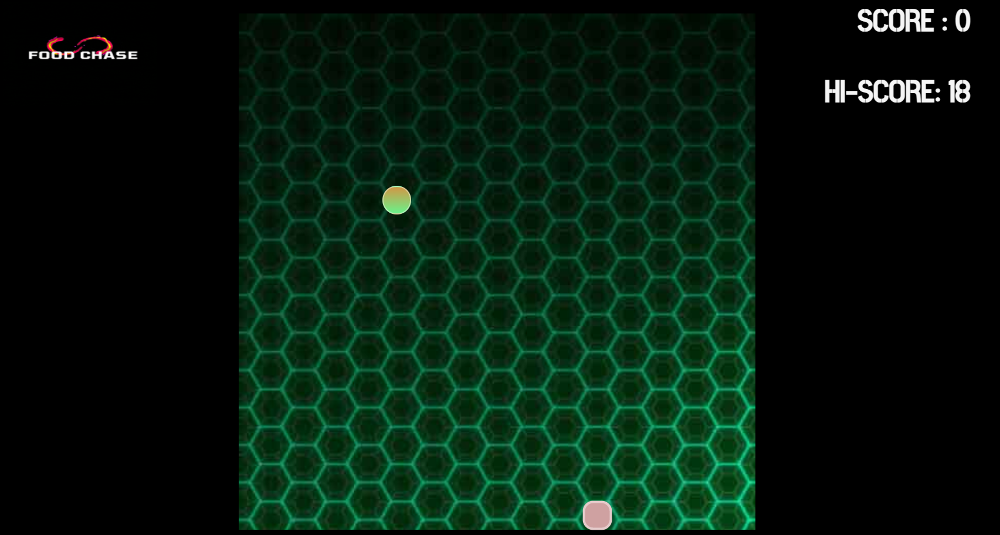
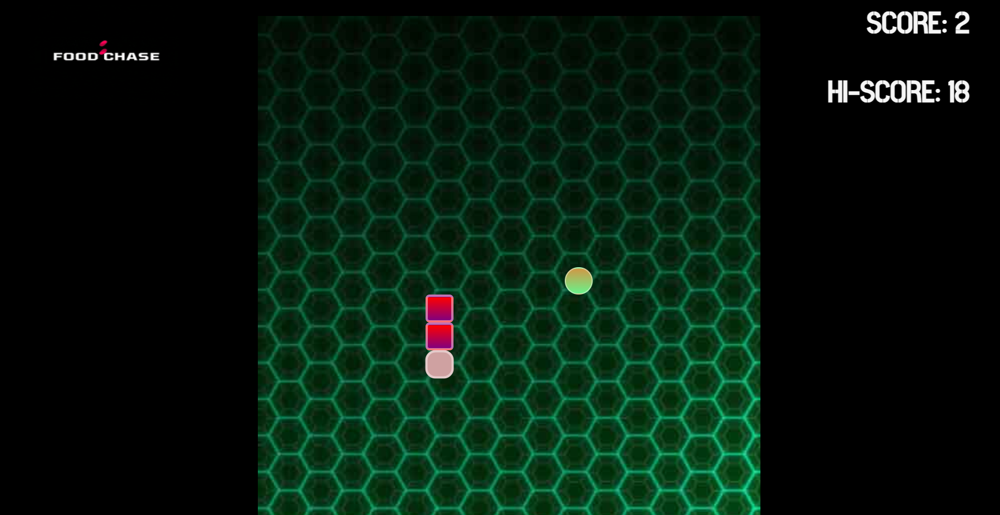
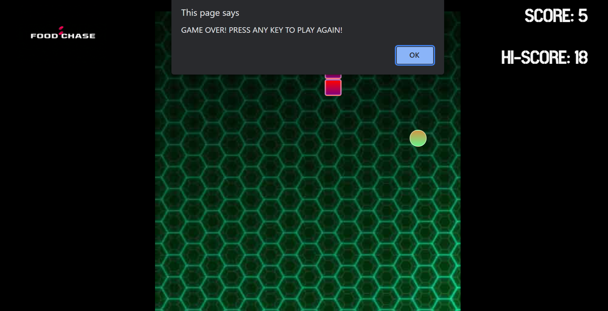

# Food-Chase

## About :
 
Food Chase is a web app (snake game) made interactive with HTML, CSS and JavaScript. 

 
 

## Functions in use :
 

1. function main(ctime) : starts the game, repaints the desktop.

2. function isCollide(snakeArr) : action to be taken when snake touches the walls. 

3. function gameEngine() : main engine of the game : updates scores, play and pause , defines action when snake eats food.

 
 

## Features :
 

1. Score and Hi-Score (Maximum Scores achieved so far)
2. Music for start, end and swallowing food - using JavaScript.
3. Graphics added using CSS.

 
 

## Keyboard Controls :
 

1. Up Arrow Key- to move upwards
2. Down Arrow Key - to move downwards
3. Left/Right Arrow Keys- to move left/right

 
 

## Insights into Interface:
 

1. Score Board:

 

2. Upon swallowing food:

 

3. Notification system at the conclusion : 

 
 
Thanks! for viewing. Enjoy playing the game :)

 
 
By - Yatheshta Vijay